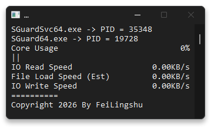

# ACEController

> [!CAUTION]
> __目前 "限制反作弊组件性能" 的行为可能被反作弊组件检测，测试时曾观察到偶发 "全区封禁5分钟" 的处罚，处罚理由为 "修改游戏客户端"+"安全系统或数据被篡改"__  
> - __如无法接受该情况，请不要使用本程序__
>> __经测试，关闭 `WeGame` 提供的各种游戏辅助和外部游戏辅助插件，似乎可减少该情况出现频率__

> ### ___本程序仅利用 `Windows` 系统内置函数实现限制反作弊性能消耗，不会也永远不可能阻止反作弊系统的运行___

---

### 程序功能

> __以下功能以从上至下顺序进行回退，所有功能如可用均默认启用__
- [x] __限制CPU使用率__
- [x] __进行CPU核心绑定__
- [x] __启用效能模式__
- [x] __配置进程优先级为低__

> [!WARNING]
> __使用前需确认以下事项__
> - __确认系统中是否存在AntiCheatExpert Service服务（程序只能响应由该服务启动的反作弊进程，如反作弊由于其他方式启动，则无法生效）__
> - __如系统中逻辑处理器数量超过`64`（去任务管理器里数框框），请不要使用本程序，`Windows` 相关函数无法对该情况提供支持__  
> ___由于反作弊进程具有极高权限，程序无法确保自身在所有情况下均能正常工作，望周知___

---

### 附加功能

- __允许自定义CPU核心绑定，具体操作详见：[https://www.bilibili.com/opus/1093470236590473287](https://www.bilibili.com/opus/1093470236590473287)__
> ___以上为上个版本程序的教程，但操作流程未变更，只需将旧版的exe文件当成新版的exe看就行了___
- __程序监测到反作弊启动后，会生成一个窗口，展示反作弊进程相关信息（其中 `File Load Speed` 项目为估算值，仅供参考）__

<blockquote>
  

    
  

  <strong>&nbsp;&nbsp;· UI 效果图</strong>
</blockquote>

> ___不要通过任何方式关闭这个窗口，手动关闭会导致工具本体进程直接退出___

---

### __运行环境__

<pre><code>需要 .Net Framework 4.8 运行时
下载链接：<a href="https://dotnet.microsoft.com/zh-cn/download/dotnet-framework/net48">https://dotnet.microsoft.com/zh-cn/download/dotnet-framework/net48</a>
注意：
  · 普通用户选择"运行时"版本即可
  · 如需自行编译，则需安装"开发包"
  · 如使用"脱机安装程序"，则需自行下载对应的地区语言包</code></pre>
